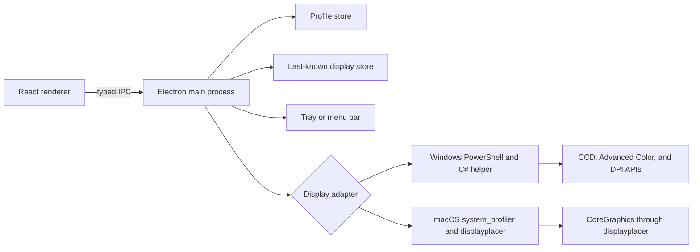

# Architecture

## Purpose

Monitor Manager separates the desktop interface from operating-system display control. The renderer works with one shared profile model, while each platform adapter translates that model into native operations.



## Runtime layers

### Renderer

`src/renderer/App.tsx` owns the application interface and keeps two display collections:

- **Live displays** contain the most recent native scan.
- **Draft displays** contain edits to Current setup or a saved profile.

The Arrangement Preview, display cards, primary star, and signal controls all render from draft state. Changes are visible immediately, but native state changes only after the user applies them.

The renderer has no direct Node.js access. Electron context isolation is enabled, and `src/main/preload.ts` exposes only the methods in `MonitorManagerApi`.

### Main process

`src/main/index.ts` owns:

- single-instance application behavior;
- window creation and hide-to-tray behavior;
- the dynamic profile menu and version label;
- monitor identification overlays;
- display-change event debouncing;
- IPC validation;
- start-at-login settings;
- platform adapter selection.

### Platform adapters

`DisplayAdapter` is the native boundary used by the main process. The current implementations are:

- `WindowsDisplayAdapter`, which launches the bundled PowerShell and C# helper.
- `MacOsDisplayAdapter`, which uses `system_profiler` and optional `displayplacer`.
- `UnsupportedDisplayAdapter`, which reports honest capability limits on other systems.

## Domain model

`DisplayInfo` represents discovered hardware and includes:

- stable and fallback identifiers;
- connection type and enabled state;
- whether an active target shares its Windows source with another target;
- primary and HDR state;
- position, resolution, refresh rate, and rotation;
- current scale and valid scale choices;
- available display modes.

`ProfileDisplay` stores the user-selected state for one monitor. Resolution, refresh rate, scaling, layout, rotation, primary role, enabled state, and HDR preference are stored separately in every profile.

Legacy profile JSON without `scalePercent` remains valid. Applying such a profile leaves the current desktop scale unchanged until the profile is saved again.

## Persistence

The application writes local JSON under Electron's per-user `userData` directory.

`profiles.json` contains schema-versioned display profiles:

```json
{
  "schemaVersion": 1,
  "profiles": []
}
```

`known-displays.json` stores the last usable active state for each display. Windows often omits source mode, position, rotation, and scaling information after a monitor is disabled. Monitor Manager hydrates the inactive target from this cache so the monitor remains editable and can return with its previous configuration.

Mirrored scans are not written to the last-known cache. Their shared resolution, orientation, and refresh rate are temporary projection values and must not replace a monitor's independent recovery state.

No telemetry, account, cloud service, or external database is used.

## Display identity

Windows source names such as `\\.\DISPLAY2` can change when cables, GPUs, or topologies change. They are fallback identifiers only.

The primary Windows identifier is the normalized device interface path returned by `DISPLAYCONFIG_TARGET_DEVICE_NAME`. Profiles match displays in this order:

1. Stable physical target identifier.
2. Current platform source identifier.

After topology changes, Windows can expose active and inactive sources for the same physical monitor. Enumeration groups duplicate stable identifiers and keeps the active path. Available inactive targets are synthesized and then hydrated from last-known state.

Stable target matching always runs before source fallback matching. This ordering is required in Duplicate mode because multiple physical targets can share the same GDI source name.

## Windows implementation

The main process launches `assets/native/windows-display.ps1` with an execution-policy bypass limited to that helper. The script compiles an in-memory C# P/Invoke type and returns one JSON response.

Native operations include:

- `EnumDisplayDevices` and `EnumDisplaySettingsEx` for GDI compatibility data and selectable modes.
- `QueryDisplayConfig` for active and available CCD paths, target names, connection types, and device paths.
- `SetDisplayConfig` for topology, source geometry, refresh rate, rotation, and saved configuration.
- Advanced Color device-info packets for HDR capability, state, and switching.
- `GetDpiForMonitor` for the effective per-monitor scale.
- source DPI device-info packets for valid Windows scaling percentages and scale application.

When a profile changes the active monitor set, application occurs in this order:

1. If Duplicate mode is active, request the persisted Windows Extend topology.
2. Submit the requested active CCD paths with invalid mode indices so Windows can establish valid independent paths.
3. Re-query the active paths.
4. Commit exact source geometry, position, target refresh rate, and rotation.
5. Re-query source identifiers and apply requested desktop scaling.
6. Apply HDR preferences to active targets.
7. Refresh native state and return the accepted configuration to the renderer.

## Windows projection compatibility

Monitor Manager and Win+P both modify the same CCD state, so neither owns the display configuration exclusively. Electron display-added, display-removed, and display-metrics-changed events trigger a debounced native refresh after an external Windows change.

| Win+P topology | Behavior |
| --- | --- |
| PC screen only | One active target and inactive targets retained for recovery |
| Second screen only | One active target and inactive targets retained for recovery |
| Extend | Fully represented by the profile model |
| Duplicate | Detected as multiple active targets sharing one source; current layout is read-only and cannot be saved |

A saved profile can exit Duplicate mode. Windows first restores its persisted Extend topology, then Monitor Manager applies the profile's exact active targets and signal settings. This two-step transition is required because the tested NVIDIA CCD stack rejected a direct supplied-path conversion from clone to extend with `ERROR_INVALID_PARAMETER`.

The DPI packet types used for Windows percentage scaling are not listed in Microsoft's public `DISPLAYCONFIG_DEVICE_INFO_TYPE` enum. The helper validates the source-reported range, exposes only accepted standard values, treats failure as a warning, and keeps topology application independent from scale application.

## macOS implementation

`system_profiler SPDisplaysDataType -json` provides discovery without extra dependencies. Full profile application is delegated to `displayplacer`, located through the user's login shell.

Enabled displays receive mode, position, refresh, and rotation arguments. Disabled displays receive `enabled:false`. The display at origin `(0,0)` is treated as primary.

macOS models UI scaling with "looks like" resolutions instead of Windows-style percentages. The current adapter reports percentage scaling as read-only. Independent HDR switching is also read-only because there is no stable public API used by this project.

## Safety and error handling

- The renderer and native helper both reject configurations with zero enabled monitors.
- Disabled Windows targets remain visible when the operating system still reports an available physical path.
- Native responses use `{ ok, message, warnings, data }`.
- Failed commits do not replace the current renderer draft.
- Duplicate layouts are detected and blocked from profile capture or direct editing.
- The app refreshes native state after every successful operation.
- Profile deletion requires explicit confirmation.
- External URLs are restricted to HTTP and HTTPS.
- Display operations run in the signed-in interactive desktop session without administrator privileges.

## Packaging

Electron Builder creates Windows NSIS and portable executables, or macOS DMG and ZIP packages. Renderer and main-process code remain inside `app.asar`. Native scripts are copied to packaged resources so PowerShell can execute them outside the archive.
