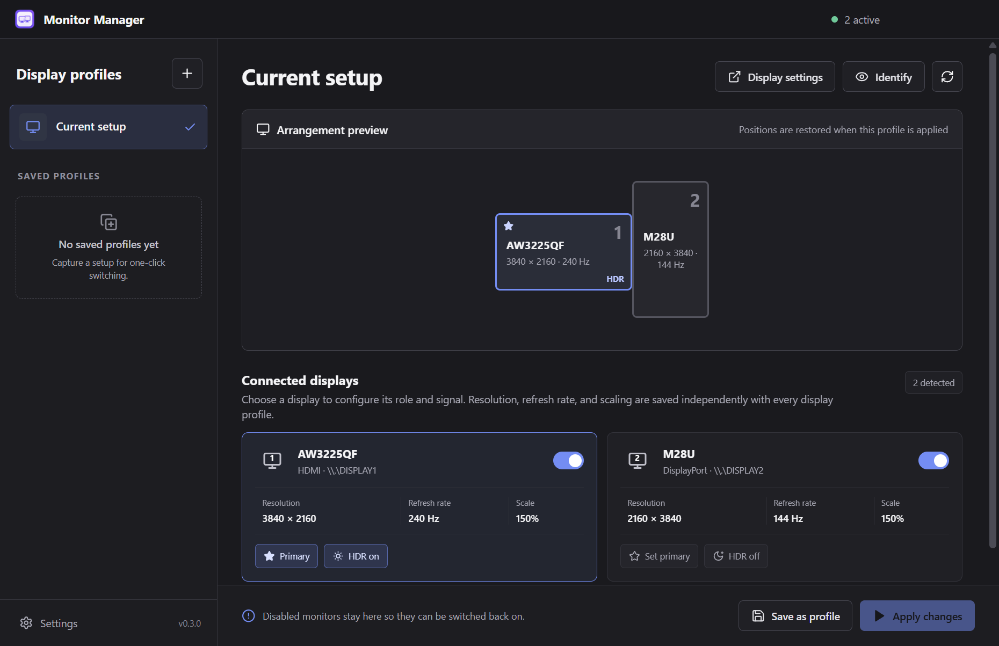
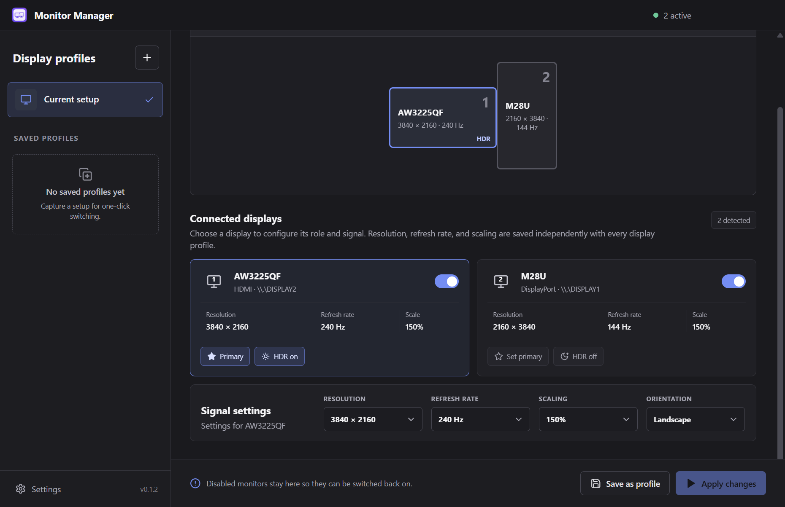
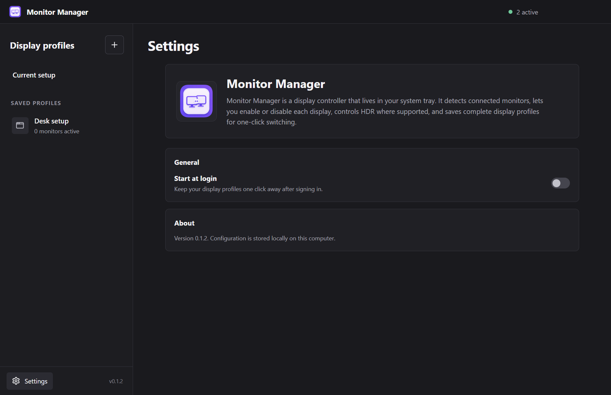
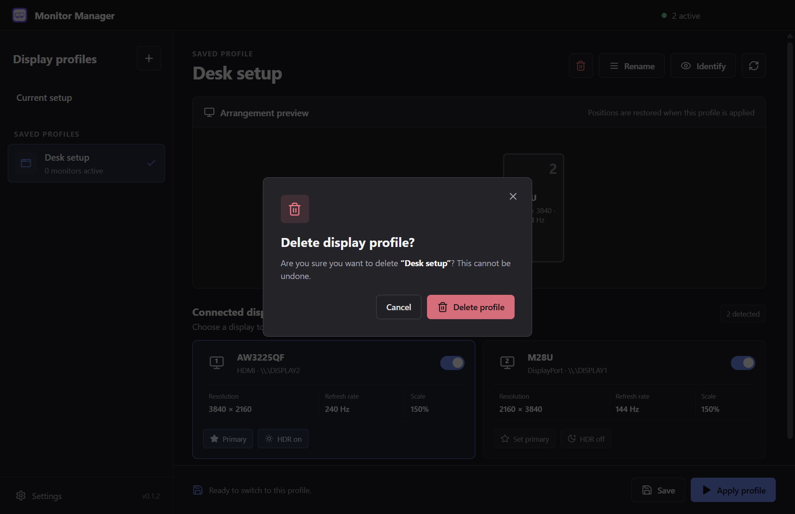

# 🖥️ Monitor Manager

[](https://github.com/mtom2k/monitor-manager/releases/tag/v0.3.0)
[](LICENSE)
[](https://github.com/mtom2k/monitor-manager/actions/workflows/ci.yml)

Monitor Manager is a tray application for switching complete multi-monitor setups. Enable or disable displays, change signal settings, control HDR, and save each arrangement as a reusable profile.



## Features

- Enable or disable individual monitors without losing access to them in the app.
- Save display profiles and switch between them from the window or system tray.
- Store resolution, refresh rate, scaling, orientation, position, primary status, and HDR preference per monitor and per profile.
- Change Windows desktop scaling with the values supported by each display.
- Restore the last known mode when a disabled Windows monitor is re-enabled.
- Detect Windows Win+P projection changes and safely recover from Duplicate mode by applying a saved profile.
- Open Windows Display settings or macOS Displays settings directly from the main toolbar.
- Identify connected displays with numbered overlays.
- Start automatically at login.
- Use the supplied Monitor Manager icon in the window, tray, and packaged application.

## Screenshots

| Signal controls | Settings |
| --- | --- |
|  |  |

| Safe profile deletion |
| --- |
|  |

## Install

Download the latest Windows installer or portable build from [GitHub Releases](https://github.com/mtom2k/monitor-manager/releases/latest).

Windows SmartScreen may warn about the application because the current release is not code-signed. Review the release checksums before running a downloaded file.

macOS source builds are available, but the macOS adapter still requires hardware testing and [`displayplacer`](https://github.com/jakehilborn/displayplacer) for profile application.

## Using display profiles

1. Open **Current setup**.
2. Select a monitor and adjust its role or signal settings.
3. Choose **Save as profile** and enter a useful name.
4. Apply the profile from Monitor Manager or the tray menu.

To restore a monitor disabled by Monitor Manager, open **Current setup**, enable that monitor, and choose **Apply changes**. A physically disconnected monitor must be reconnected before Windows can activate it.

## Windows Win+P behavior

**PC screen only**, **Second screen only**, and **Extend** are compatible with Monitor Manager. The app refreshes when Windows changes the active display topology, keeps disabled targets available, and can restore them through a saved profile.

**Duplicate** uses one shared Windows source for multiple physical monitors. Monitor Manager detects and labels that state, but does not save or edit mirrored layouts. Choose **Extend** in Win+P, or apply a saved Monitor Manager profile to return to independent displays.

Changes applied in the operating system are refreshed through display events and whenever Monitor Manager regains focus. Changes applied by Monitor Manager use the operating system display configuration, so the native settings panel reflects the accepted configuration too.

## Platform support

| Capability | Windows | macOS |
| --- | --- | --- |
| Display discovery | Native, hardware verified | Native discovery |
| Resolution, refresh, rotation, and position | Native CCD APIs, hardware verified | `displayplacer` |
| Enable and disable displays | Native CCD APIs, hardware verified | `displayplacer` |
| Per-display scaling | Supported, hardware verified | Read-only percentage |
| HDR switching | Supported, hardware verified | Read-only |
| Tray or menu bar profiles | Supported | Supported |
| Start at login | Supported | Supported |

## Development

Requirements:

- Node.js 20.19 or newer
- npm
- Windows 10/11 or macOS

```powershell
npm.cmd install
npm.cmd run dev
```

Quality and packaging commands:

```powershell
npm.cmd run typecheck
npm.cmd test
npm.cmd run build
npm.cmd run package:win
```

Run `npm run package:mac` on macOS to create DMG and ZIP packages.

## Project documentation

- [Architecture](ARCHITECTURE.md): components, state flow, persistence, and native boundaries
- [Decisions](DECISIONS.md): accepted architecture decisions and tradeoffs
- [Testing](TESTING.md): automated checks, hardware verification, and release checklist
- [Handoff](HANDOFF.md): implementation notes, known limitations, and recommended next work
- [Changelog](CHANGELOG.md): version history
- [Contributing](CONTRIBUTING.md): local setup and contribution workflow

## License

Monitor Manager is released under the [MIT License](LICENSE). The logo under `assets/branding` is the official project artwork supplied by the project owner.
